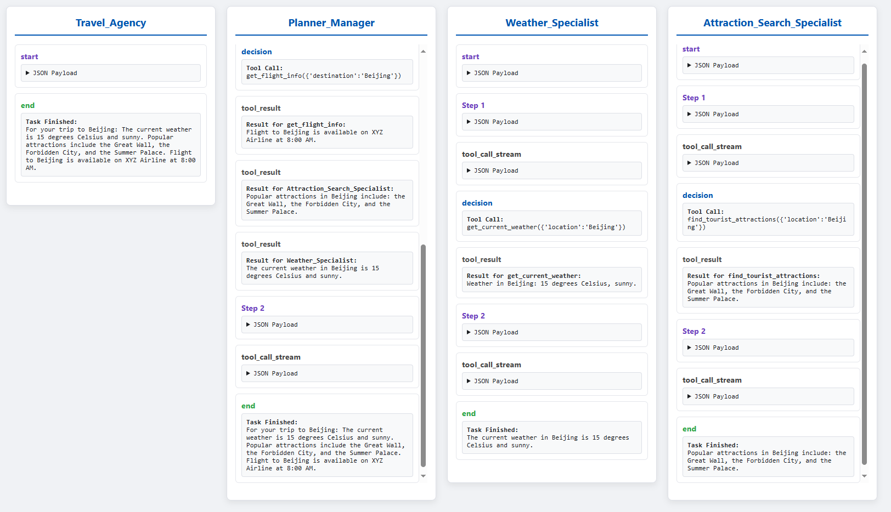
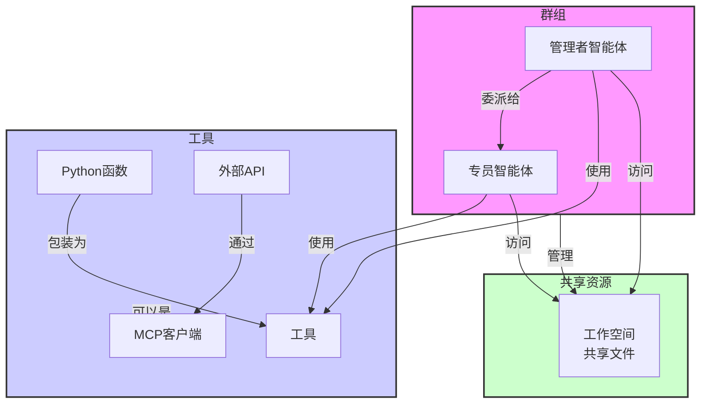

[English](./README.md)

# Agenticle

[](https://badge.fury.io/py/agenticle)
[](https://opensource.org/licenses/MIT)
[](https://pypi.org/project/agenticle)

Agenticle 是一个轻量级的、事件驱动的 Python 框架，用于构建和编排多智能体系统。它提供了简单而强大的抽象，用于创建独立的智能体，为它们配备工具，并让它们在群组中协作以解决复杂任务。

## ✨ 亮点

-   ✅ **声明式多智能体系统**: 使用单个 YAML 文件轻松定义、管理和版本化复杂的多智能体工作流。
-   ✅ **内置实时仪表盘**: 无需额外配置，即时可视化智能体的思考过程和协作流程，让调试变得直观。
-   ✅ **灵活的协作模式**: 原生支持 `manager_delegation`、`voting` 和 `competition` 等多种团队动态，以编排复杂的智能体交互。
-   ✅ **可扩展与互操作**: 通过模型上下文协议 (MCP) 与任何语言编写的外部工具和服务无缝集成。
-   ✅ **并行工具执行**: 智能体可以并发执行多个工具，极大地加快了 I/O 密集型任务的速度。

## 安装

直接从 PyPI 安装包：

```bash
pip install agenticle
```

对于开发，克隆仓库并以可编辑模式安装：

```bash
git clone https://github.com/A03HCY/Agenticle.git
cd Agenticle
pip install -e .
```

## 🚀 快速入门

有两种方式可以开始：编程式的 Python 方法（非常适合快速实验）和声明式的 YAML 方法（推荐用于管理复杂系统）。

### 选项 1: 编程式方式 (Python)

您可以直接在 Python 中定义所有的智能体和群组。

```python
from agenticle import Agent, Group, Tool, Endpoint

# 1. 定义工具函数
def get_current_weather(location: str) -> str:
    """获取指定地点的当前天气。"""
    return f"{location}的天气：15摄氏度，晴朗。"

# 2. 创建一个端点配置
openai_endpoint = Endpoint(
    api_key='你的API密钥',
    base_url='你的API基础URL'
)

# 3. 创建专员智能体
weather_agent = Agent(
    name="天气专员",
    description="专门为给定城市获取天气信息。",
    tools=[Tool(get_current_weather)],
    endpoint=openai_endpoint,
    model_id='你的模型ID'
)

# 4. 创建管理者智能体
planner_agent = Agent(
    name="规划经理",
    description="一个聪明的规划者，能够分解请求并将任务委派给专员。",
    input_parameters=[{"name": "user_request"}],
    tools=[], # 管理者只委派任务，自己不工作
    endpoint=openai_endpoint,
    model_id='你的模型ID'
)

# 5. 组建群组
travel_agency = Group(
    name="旅行社",
    agents=[planner_agent, weather_agent],
    manager_agent_name="规划经理",
    mode='manager_delegation'
)

# 6. 运行群组
user_query = "我想去北京旅行。天气怎么样？"
event_stream = travel_agency.run(stream=True, user_request=user_query)

for event in event_stream:
    print(event)
```

### 选项 2: 声明式方式 (YAML)

这是构建和管理多智能体系统的推荐方法。

**1. 创建 `agents.yaml`:**

定义一个管理者和一个专员。管理者会将任务委派给专员。

```yaml
# agents.yaml
endpoints:
  default:
    api_key: "你的API密钥" # 或使用环境变量 API_KEY
    base_url: "你的API基础URL"

agents:
  - name: 天气专员
    description: "专门为给定城市获取天气信息。"
    input_parameters: [{name: "city"}]
    tools: ["get_current_weather"] # 这个工具将在 Python 中提供
    model_id: "你的模型ID"
    endpoint: "default"

  - name: 规划经理
    description: "一个聪明的规划者，能够分解请求并将任务委派给合适的专员。"
    input_parameters: [{name: "user_request"}]
    tools: ["天气专员"] # 使用另一个智能体作为工具
    model_id: "你的模型ID"
    endpoint: "default"

groups:
  - name: 旅行社
    agents: ["规划经理", "天气专员"]
    manager_agent_name: "规划经理"
    mode: "manager_delegation"
```

**2. 创建 `main.py`:**

加载 YAML 文件，并为 `get_current_weather` 工具提供 Python 函数。

```python
from agenticle import Model, Tool

# 为 YAML 中提到的工具定义 Python 函数
def get_current_weather(location: str) -> str:
    """获取指定地点的当前天气。"""
    return f"{location}的天气：15摄氏度，晴朗。"

# 从 YAML 文件加载整个系统
# Tool 对象会根据函数自动创建
model = Model(path="agents.yaml", tools=[get_current_weather])

# 访问在 YAML 中定义的群组
travel_agency = model.groups["旅行社"]

# 运行群组并流式传输事件
event_stream = travel_agency.run(stream=True, user_request="北京的天气怎么样？")
for event in event_stream:
    print(event)
```

**3. 运行它!**

```bash
python main.py
```

您将看到一个实时的事件流，展示了 `规划经理` 接收请求，决定委派给 `天气专员`，并获得最终结果的全过程。

## 内置工具

Agenticle 开箱即用地提供了强大的监控和集成工具。

### 实时监控仪表盘

实时可视化来自任何 `Agent` 或 `Group` 的事件流。它非常适合调试和观察智能体行为。



**如何使用:**

1.  安装仪表盘依赖: `pip install "agenticle[dashboard]"`
2.  使用 `Dashboard` 包装您的智能体/群组并运行它。

```python
from agenticle import Agent, Dashboard

# 假设 'my_agent' 是一个已经配置好的 Agent 实例
agent_args = {"query": "伦敦的天气怎么样？"}

# 包装智能体并运行仪表盘服务器
dashboard = Dashboard(my_agent, **agent_args)
dashboard.run() # 服务器启动于 http://127.0.0.1:8000
```

### RESTful API 服务器

通过 RESTful API 暴露您的智能体和群组，以便将 Agenticle 集成到更大型的应用程序中。

**如何使用:**

1.  安装 API 依赖: `pip install "agenticle[api]"`
2.  注册您的智能体并启动服务器。

```python
# in run_api.py
import agenticle.server as server
from agenticle.agent import Agent

# 1. 定义您的智能体
my_agent = Agent(...)

# 2. 用一个唯一的名称注册它
server.register("my_agent_api_name", my_agent)

# 3. 启动服务器
if __name__ == "__main__":
    server.start_server()
```

现在您可以通过 HTTP 端点与您的智能体进行交互，以进行流式或异步任务执行。

## 核心概念

### 架构

Agenticle 的核心组件协同工作，以实现复杂的多智能体协作。



### Agent (智能体)

`Agent` 是最基本的行动者。它由其 `name` (名称)、`description` (描述)、`tools` (工具) 以及它使用的 LLM `endpoint` (端点) 来定义。智能体遵循“思考-行动”循环来推理任务并决定使用哪个工具。

### Group (群组)

`Group` 负责编排多个 `Agent` 实例。其行为由 `mode` (模式) 决定：
-   `'manager_delegation'`: 管理者智能体将任务委派给专员智能体。
-   `'broadcast'`: 每个智能体都可以与其他所有智能体通信。
-   `'round_robin'`: 智能体按顺序执行，形成一个处理流水线。
-   `'voting'`: 智能体并行运行并对最终答案进行投票。
-   `'competition'`: 智能体竞争产生最佳答案，然后由一个优化器智能体选出。

### Workspace (工作空间)

`Workspace` 是一个沙盒化的目录，可由 `Group` 中的所有智能体共享。这使它们能够通过读写文件进行协作，从而支持有状态的、长时间运行的任务。

### 理解事件流

Agenticle 中的每一个动作都会生成一个 `Event` (事件)。通过流式传输这些事件，您可以获得一个透明的、实时的执行过程视图，从智能体内部的 `reasoning_stream` (思考流) 到其最终的 `decision` (决策) 和 `tool_result` (工具结果)。这是监控仪表盘的基础，也使得调试变得容易。

### 通过 MCP 与外部工具集成

Agenticle 支持 **模型上下文协议 (Model Context Protocol, MCP)**，允许智能体连接到外部的、语言无关的工具服务器。这意味着您可以像使用本地 Python 函数一样轻松地与微服务、外部 API 或用其他语言编写的工具集成。

## 高级用法

### 使用 YAML 进行声明式配置

在 YAML 中定义您的系统可以将架构与代码分离，使复杂配置易于管理。
-   **`model = Model(path="...", tools=[...])`**: 从 YAML 文件加载系统。您必须在运行时提供任何不可序列化的工具（如 Python 函数）。
-   **`modeliz(agents=[...], groups=[...], path="...")`**: 将以编程方式创建的系统序列化为 YAML 文件。这对于快照动态配置非常有用。

### 使用提示词定制智能体行为

您可以通过提供自定义的 Jinja2 提示词模板来完全重新定义智能体的行为、个性及推理结构。

```python
custom_agent = Agent(
    name="自定义智能体",
    # ... 其他参数
    prompt_template_path="path/to/your/custom_prompt.md"
)
```

您的模板可以使用 `{{ agent_name }}`、`{{ agent_description }}` 和 `{{ tools }}` 列表等变量，在运行时动态生成系统提示词。
